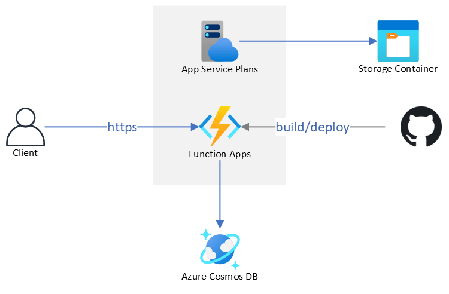
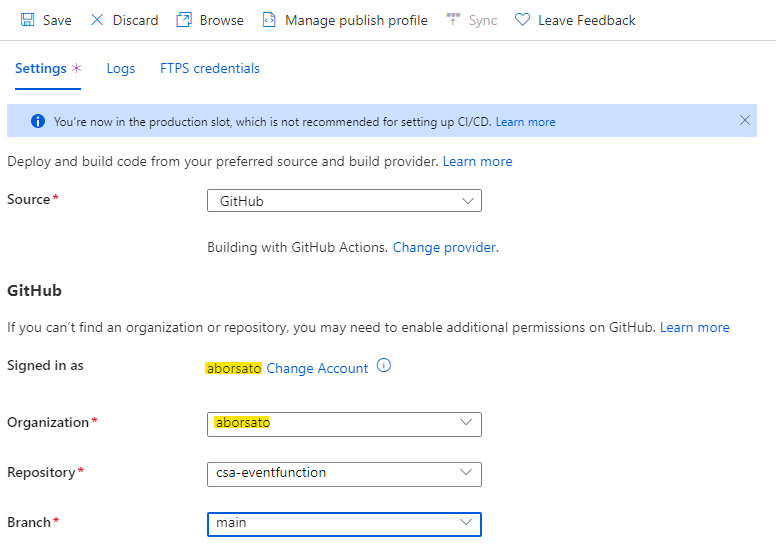
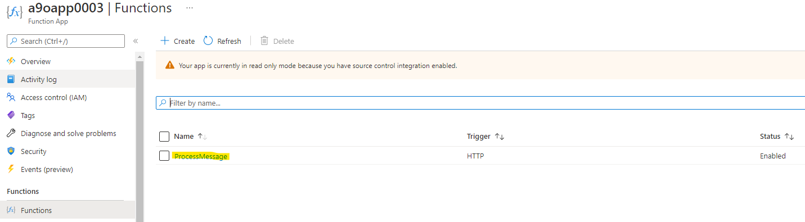

# Azure Functions with Cosmos DB
This is a sample deployment to get started with serverless functions in Azure, featuring:
- Azure Functions
- Azure Cosmos DB
It demonstrates how an Azure Function is triggered by an HTTP endpoint to save the payload as a document do Cosmos DB.


# Landing Zone

Azure landing zones are the output of a multisubscription Azure environment that accounts for scale, security governance, networking, and identity. Azure landing zones enable application migration, modernization, and innovation at enterprise-scale in Azure. These zones consider all platform resources that are required to support the customer's application portfolio and don't differentiate between infrastructure as a service or platform as a service.


## Target Audience

- Cloud Solution Architect
- Cloud Infrastructure Architect
- Application Developer/DevOps Engineer

## Architecture




## Deploy Resources

Use the link below to deploy the entire solution to the subscription you want.

[](https://portal.azure.com/#create/Microsoft.Template/uri/https%3A%2F%2Fraw.githubusercontent.com%2Faborsato%2Fcsa-eventfunction%2Fmaster%2Fazuredeploy.json)

## Deploy this Function App

1. Fork this repository by clicking the `Fork` button at the top right corner of this repo.
1. Deploy the resources to your subscription as per [Deploy Resources](#deploy-resources) section.
1. After your deployment is completed, navigate to your Functions App in Azure Portal, then open the `Deployment Center` blade.
1. Select `GitHub` as deployment source, connect your GitHub account, then fill all information to point to your forked repo:

   

1. Click `Save` and wait a few minutes for the deployment to complete. The new function `ProcessMessage` will be listed in the `Functions` blade.

   


## Test the Function

1. Using the Test Function in Azure Portal
   - Navigate to the `Function App` > `Functions` blade
   - Click the function name
   - Navigate to `Code + Test` blade
   - Click `Test/Run` button
   - Click `Run` button

1. Using `curl`
   - Navigate to the `Function App` > `Functions` blade
   - Click the function name
   - Click `Get Function URL` button, copy the value
   - Run this code in a command line:
   ```bash
   curl FUNCTION_URL -d '{"name": "Myself"}'
   ```


## Azure services and related products

- [Azure Functions](https://docs.microsoft.com/en-us/azure/azure-functions/)
- [Cosmos Database](https://docs.microsoft.com/en-us/azure/cosmos-db/)
